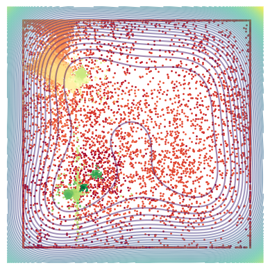

# Implementation and Visualisation of the Slime Mould Algorithm

The notebook implements the slime mould algorithm as described in the paper [Slime Mould Algorithm](https://doi.org/10.1016/j.future.2020.03.055). It references [the author's MatLab code](
https://github.com/aliasgharheidaricom/Slime-Mould-Algorithm-A-New-Method-for-Stochastic-Optimization-) to resolve ambiguities in the paper.

## Components

This project has two components:

* [An IPython notebook](./sma.ipynb): This is the implementation. Developed from a tutorial in [ograph 1.1.1](https://pypi.org/project/ograph/)

* [An animated GIF](./sma_animation.gif): This an animation of the learning process. Can be reproduced by running the notebook.

## Licences

This project uses the MIT license. Parts of it translate (from MatLab to Python) code by Li, Heidari, and Chen under the [MIT licence](./licenses/LICENSE-REF).

